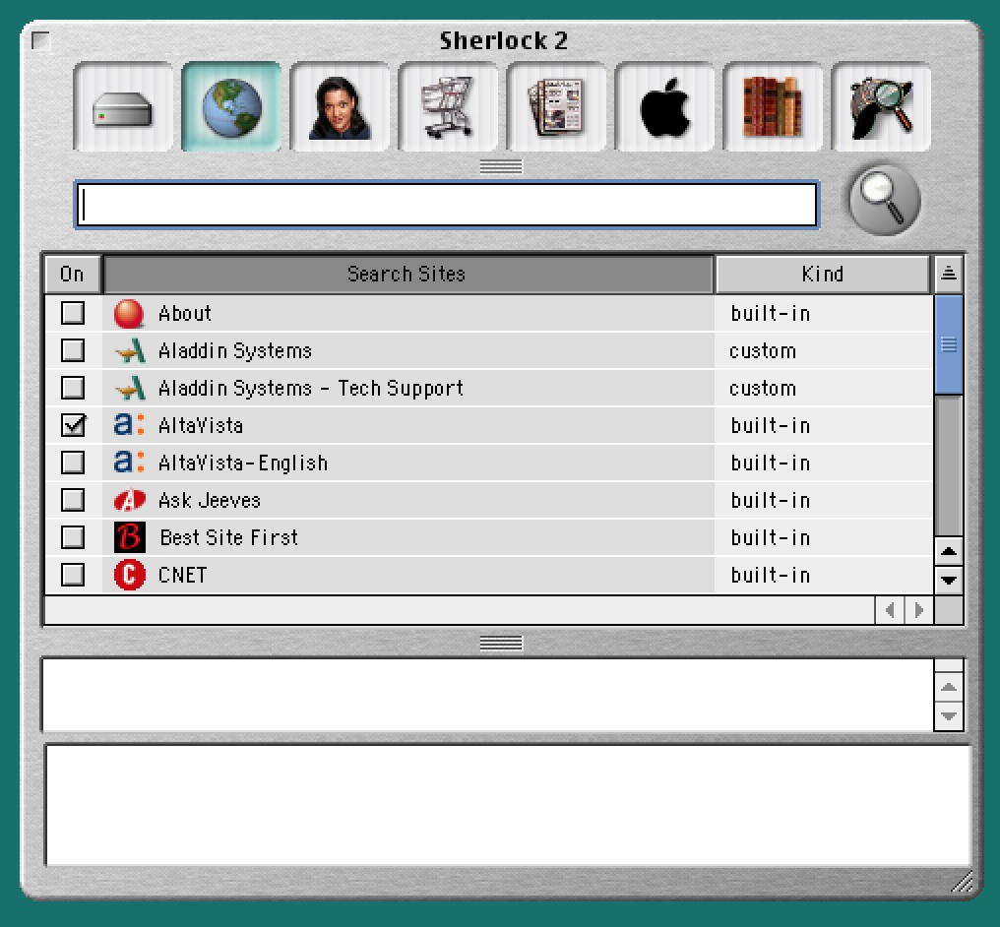
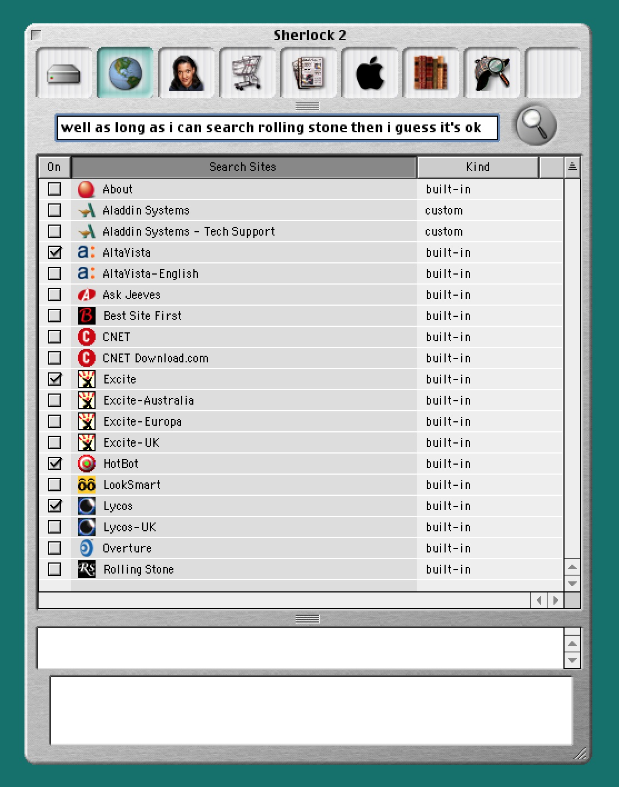
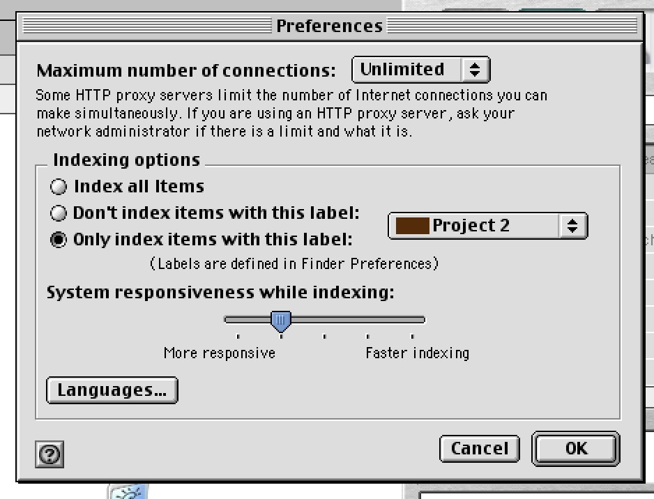

# Dash Board 2013

a Comic Tragedy in Nine Acts, by Mason Mark (principal author of Dash Board)

*June 30, 2013 — Tokyo, Japan*

## TL;DR

This is the (very belated and procrastinated) open source release of Dash Board for Newton OS.

Dash Board was a popular interface enhancement for Newton OS 2.1 in the late 1990s. 

To run this software on your Newton or (more likely) your [Newton Emulator](http://code.google.com/p/einstein/), you need only install the packages *DashBoard2013.proj.pkg* and *DashBoardPrefs.proj.pkg*, which can be found alongside their respective project files in this archive.

To hack on and build this software, however, you will definitely need to read the instructions below, because it is a fairly convoluted process, for historical reasons, and is not at all obvious even for people who are familiar with compiling software from the source.

Dash Board requires Newton OS 2.1.

## The Whole Story

June 30, 2013 marks the 15th anniversary of the release of Dash Board 1.0 for Newton OS.

I've been meaning to make Dash Board free for many years now, and this project, "Dash Board 2013" is the long-procrastinated effort to do that. However, for reasons described below, it wasn't just a simple matter of uploading the source code to GitHub and posting a note to the NewtonTalk mailing list.

### Act I — Dude, where's my source?

The first question I had to ask myself was: hmm, yeah, where the fuck *is* the Dash Board source code?

The answer was -- and is -- that nobody knows. The best guess is that the only remaining copy of the canonical 1.5.1 release archive is on a server backup CDROM in a spindle in a ziplock bag in a box on a pallet in the basement of the building that housed Five Speed's old office in Málaga, Spain. (That office closed in 2004.)

So I don't have *the* source code. But I did find *some* source code on an old, scratched, wine-spattered DVD of miscellaneous backups from my personal archives from 2001, which amazingly could still be read.

However, just because the data could be read, that turned out to not mean that it could be used easily. The DVD didn't contain a back up of the code itself, it contained a backup of the CVS source control server data which *contained* the code. The source code was in there, but it was in an obscure and frankly *fucktarded to the bone* data format from 1999. 

### Act II — Cockamamie Vagarious Suckage (CVS)

Throughout the development of Dash Board

### Act III — Mac OS X.III, That Is

*Description forthcoming.*

### Act IV — Shaving years off the OS

blah blah Mac OS 9 etc etc 

Um, WTF is this abomination? Was that really a thing?

Oh, I guess as long as I can search Rolling Stone online then it's cool.

I don't bring it up merely to ridicule, though, there is a minor point. You may want to do this to prevent ol' Mac OS 9 from trying to index what it sees as an enormous Mac hard disk full of strange alien files from the future... 

Notice that there is no "Don't index anything" option. That still cracks me up.

### Act V — NTK

*Description forthcoming.*

### Act VI — Einstein

*Description forthcoming.*

### Act VII — Git

*Description forthcoming.*

### Act VIII — Foo and Bar

*Description forthcoming.*

### Act IX — Baz

*Description forthcoming.*

## Additional Notes, Musings, and Grievances

I confirmed that the text "2013" doesn't exist anywhere in the project. So, I decided to annotate all changes to the source code made in 2013, as opposed to the 1990s, with "2013".

The C++ code has truly been lost. I don't really know how that happened. I think maybe it had to live in a weird location due to the limitations of the tools?

At any rate, the only reason that there was C++ code in Dash Board at all was to make the demo time limit checks and serial number checks (marginally) more difficult to reverse engineer. So the goal for DB2013 will just be remove all the code that wants to use that functionality as unobtrusively as possible.

### How to Build
1. Clone the repo to your Mac OS X 10.8 system (no other Mac OS X has been tested yet)
2. In the terminal, cd into the top level folder of the repo
3. To hack on the source code, you must re-assemble all the files, which to be used with git have been split into separate data and resource forks (AppleDouble format). To do so, try this command:

        /System/Library/CoreServices/FixupResourceForks .

  and do not omit that trailing . or who knows what the hell might happen.
4. Use the SheepShaver emulator to boot Mac OS 9, and configure it to mount the OS X folder containing the repo as a disk. *Don't copy the repo to your SheepShaver VM's native storage, because it seems to lose the invisible git dirs when copying it back, thereby corrupting the repo.*
5. Hack, hack, hack, build.
6. Once you have completed a change you want to commit to the git repo, quit out of Newton Toolkit, and then go back to the OS X side of things. Again cd into the repo root dir, and run this command:

        SplitForks .

  This will again split the resource forks off of all files who have one, and store them as a separate invisible file (AppleDouble format). This convoluted dance is necessary because git absolutely doesn't work with resource forks and Newton Toolkit absolutely doesn't work without them.
7. Commit your changes, then grab a frosty beverage.

以上
